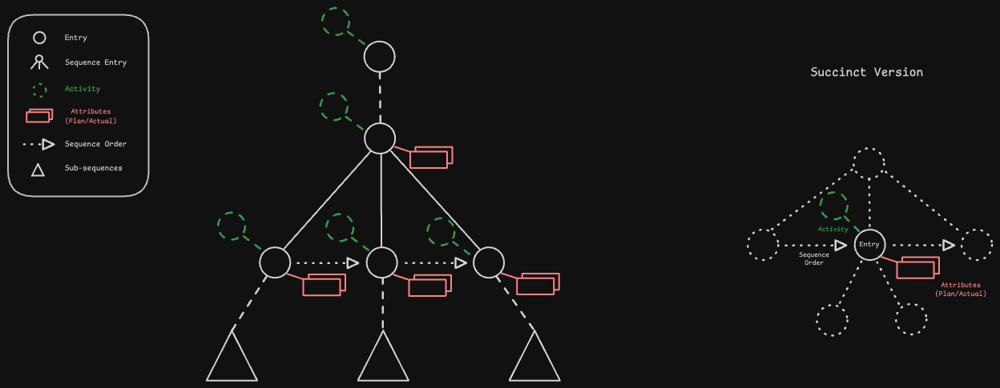
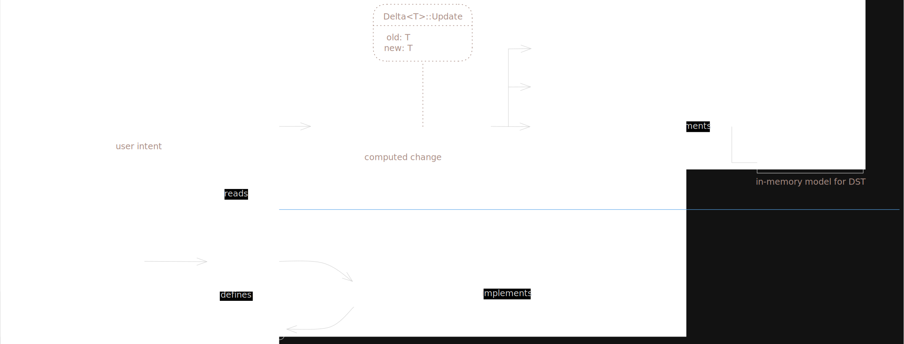

# Gainzville

Gainzville is a platform for athletes to log, analyze, and explore their
training. Instead of giving you a menu of predefined activities and data attributes, Gainzville
gives you the building blocks to create them.

https://github.com/user-attachments/assets/0d4f12cd-2e30-4372-9635-8e83e396f544

## Overview
- Users define a library of `Activities` (event categories) and typed data `Attributes`. They log
`Entries` of activities described by attributes. Training is analyzed using a domain-specific query
engine (WIP).
- One Rust core compiled into a SQLite client, a Postgres server, and a Swift app. The same actions
and queries run on every target; a thin FFI crate exposes core functionality to Swift.
- Writes are reified as mutations + deltas: mutations capture user intent, deltas are invertible
insert/update/delete records that support undo/redo, time-travel, and client-side rebasing.
- Randomized generation of user actions exercises rare code-paths in testing. Injected IO makes runs
deterministic to support reproducibility and deterministic simulation testing (WIP).
- Rust owns query subscriptions and a shared cache, Swift owns the main thread and reads cache
updates at its own cadence to debounce rapid updates and maintain snapshot isolation.

## The Data Model

Gainzville models an event, like performing an exercise, as an `Entry`: a node in a forest of entry
trees where each root has a timestamp. Entries with children are `Sequences` allowing composition of
workouts and organization of the training log. Entries may be instances of `Activities`, a categorical
description like "Run" or "Single-Leg Romanian Deadlift". Entries may be described by `Attributes`
containing typed nominal/ordinal/interval/ratio data.

     
    <em>The core model: exercises form a time-ordered forest with typed attributes and activity categorization</em>

Activities, attributes, and entries are defined and created by users. Gainzville includes a
(nascent) standard library of common activities and attributes built out of the same primitives
exposed to the user. This flexible meta-model gives users the convenience of an off-the-shelf
library of exercises and workouts while maintaining the flexibility to accommodate novel training
modalities.

## Reads and Writes

     
    <em>Read-write architecture</em>

## Repository layout

### Rust crates

| Crate | Role |
|-------|------|
| `gv-core` | Domain model, actions, mutators, queries, delta/mutation types. No `sqlx` or `uniffi` dependency. |
| `gv-sql` | DB boundary: leaf column encoders, row table mirrors, `core ↔ Row` transforms, and per-backend `Sqlite*`/`Postgres*` executors. |
| `gv-client` | SQLite app shell: connection pool, app lifecycle, subscriptions. Offline-first target. |
| `gv-server` | Postgres HTTP server: routes, auth, request handling. HTTP API + sync target. |
| `gv-ffi` | FFI boundary: exposes `gv-core` types to Swift via UniFFI. |
| `generation` | Arbitrary data generation for deterministic simulation and integration tests. |
| `ivm` | Experimental DBSP / incremental view maintenance for sync. |

### Swift app

The primary UI lives in [`swift-app/`](./swift-app) — a SwiftUI app targeting
iOS and macOS, backed by the Rust core through a generated XCFramework.

## Documentation

The [`docs/`](./docs) tree covers the design in depth. Good entry points:

| Doc | Topic |
|-----|-------|
| [Domain model](./docs/model.md) | Entities (Entry, Activity, Attribute, Value) and the ordered-forest structure |
| [Actions and queries](./docs/actions_and_queries.md) | The core write path and read path |
| [Boundary transformations](./docs/boundary-transformations.md) | How domain types cross the DB and FFI boundaries |
| [Sync](./docs/sync.md) | Offline-first sync: rebasing, conflict resolution, global sequence numbers |
| [Permissions](./docs/permissions.md) | Authorization and the actor/user model |
| [Attributes / Values](./docs/attributes-design.md) | The typed attribute system |

Swift app patterns and platform notes: [`swift-app/SWIFT-APP.md`](./swift-app/SWIFT-APP.md).

## Getting started

Building and running — including the Postgres setup, migrations, and how to
build the Rust core for the Swift app — is documented in
[DEVELOPMENT.md](./DEVELOPMENT.md).
