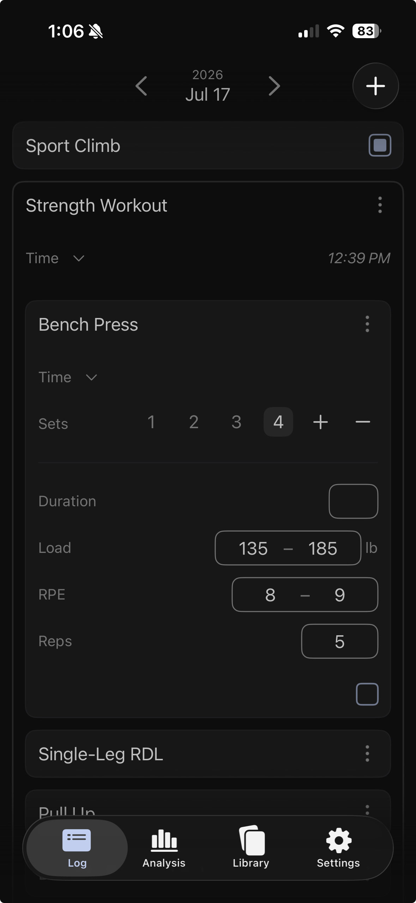

# Gainzville

Gainzville is a platform for athletes to log, analyze, and explore (refine? expand? grow?) their
training. Instead of just giving you a menu of predefined activities and data attributes, Gainzville
gives you the building blocks to create them. 

     
    <em>Nested sets with typed, range-valued attributes (Load, RPE, Reps)</em>

Gainzville models workouts, activities, and arbitrary structured measurements as an ordered forest
of entries, syncs across devices, and drives a native Swift app for iOS and macOS.

The project is built around a single Rust domain core that is shared, unchanged, by an offline
SQLite client, a Postgres HTTP server, and a Swift UI (via a UniFFI boundary). The same actions and
queries run on every target.

    <video src="https://github.com/user-attachments/assets/422e7303-3c18-4b64-affc-62a6cbc2eec8" width="300" muted autoplay loop playsinline controls></video>
  

## In-Progress

- **Offline-first sync.** All reads/writes go through the action/mutation/query system. Writes are
reified as as mutations and deltas, mutations capture user-intent, deltas are fine-grained
insert/update/delete packets that allow time-travel, undo-redo, and client-side rebasing for server
reconciliation of sync conflicts.
- **Swift FFI**: Outbox pattern modeled after `ghostty`: the Rust core maintains query subscriptions,
writes the latest data to a shared in-memory cache, and notifies the Swift app when updates are available.
Swift reads the latest cache values at it's discretion, letting Swift own the main thread and debounce
rapid updates.
- **Deterministic simulation testing.** The `Arbitrary` trait allows for generation of arbitrary
domain values and simulating long runs of user actions to exercise rare code paths. Heavily inspired
by Turso and TigerBeetle.
- **Analytic query engine.** Custom queries over the user-created catalog of activites and attributes
via a custom query engine, WIP on the analysis branch.

## Repository layout

### Rust crates

| Crate | Role |
|-------|------|
| `gv-core` | Domain model, actions, mutators, queries, delta/mutation types. No `sqlx` or `uniffi` dependency. |
| `gv-sql` | DB boundary: leaf column encoders, row table mirrors, `core ↔ Row` transforms, and per-backend `Sqlite*`/`Postgres*` executors. |
| `gv-client` | SQLite app shell: connection pool, app lifecycle, subscriptions. Offline-first target. |
| `gv-server` | Postgres HTTP server: routes, auth, request handling. HTTP API + sync target. |
| `gv-ffi` | FFI boundary: exposes `gv-core` types to Swift via UniFFI. |
| `generation` | Arbitrary data generation for deterministic simulation and integration tests. |
| `ivm` | Experimental DBSP / incremental view maintenance for sync. |

### Swift app

The primary UI lives in [`swift-app/`](./swift-app) — a SwiftUI app targeting
iOS and macOS, backed by the Rust core through a generated XCFramework.

## Documentation

The [`docs/`](./docs) tree covers the design in depth. Good entry points:

| Doc | Topic |
|-----|-------|
| [Domain model](./docs/model.md) | Entities (Entry, Activity, Attribute, Value) and the ordered-forest structure |
| [Actions and queries](./docs/actions_and_queries.md) | The core write path and read path |
| [Boundary transformations](./docs/boundary-transformations.md) | How domain types cross the DB and FFI boundaries |
| [Sync](./docs/sync.md) | Offline-first sync: rebasing, conflict resolution, global sequence numbers |
| [Permissions](./docs/permissions.md) | Authorization and the actor/user model |
| [Attributes / Values](./docs/attributes-design.md) | The typed attribute system |

Swift app patterns and platform notes: [`swift-app/SWIFT-APP.md`](./swift-app/SWIFT-APP.md).

## Getting started

Building and running — including the Postgres setup, migrations, and how to
build the Rust core for the Swift app — is documented in
[DEVELOPMENT.md](./DEVELOPMENT.md).
