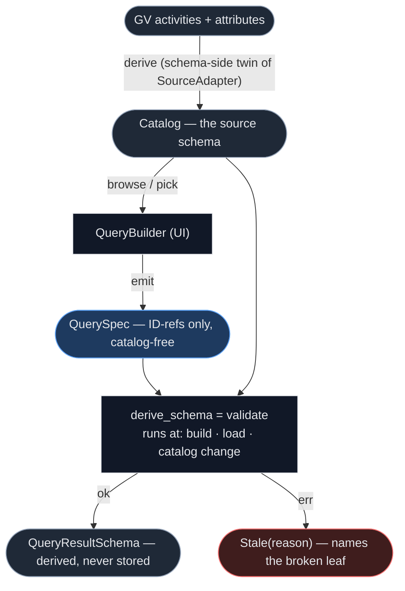
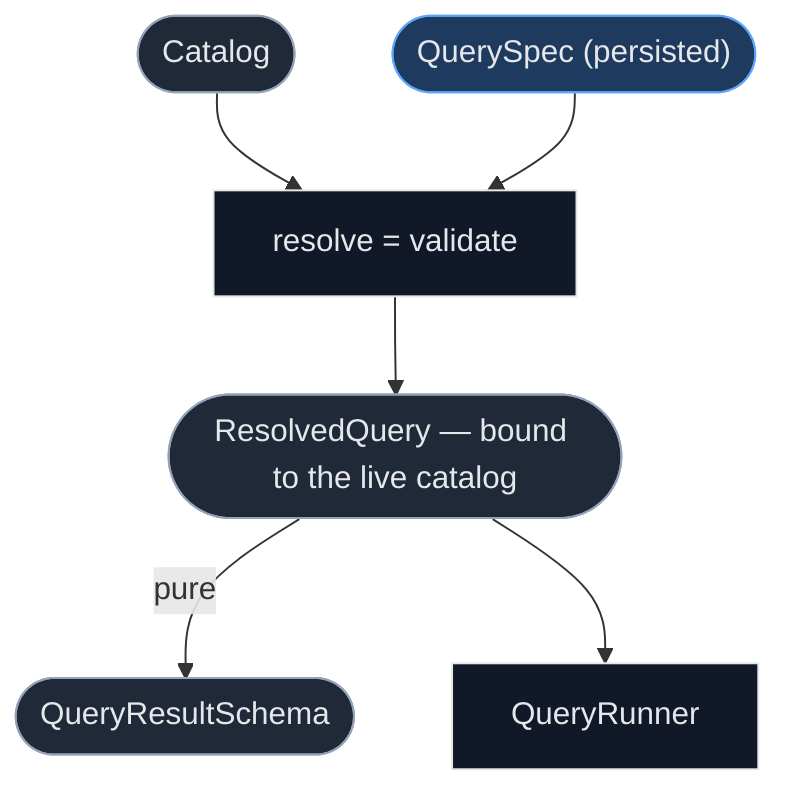

# Analysis architecture — Catalog / QuerySpec / QueryResultSchema (sketch)

> Draft supporting the high-level analysis architecture diagram. Covers one section:
> how the result schema is derived and validated. Two conventions used throughout:
> **rectangles = functions/modules (code)**, **rounded = data (types)**; persisted vs
> derived is color-coded.

## Main form: two-input derivation

The persisted `QuerySpec` stays **catalog-free** (ID references only), so the schema is
`f(QuerySpec, Catalog_now)` — the catalog is a *fresh* input on every derivation, which is
what makes derivation double as the **staleness gate**. Derivation runs at three trigger
points: **build** (feeds VizBuilder), **load** (validate a saved artifact), and
**catalog change** (subscription-driven revalidation). GV's additive-only attribute
configs make most catalog changes *compatible* (domains grow; charts gain empty slots);
true staleness is confined to deletions and structural changes.

- `QuerySpec` (blue) is the persisted declaration; everything else is derived or code.
- If the spec *embedded* catalog knowledge (types/domains), it would be a snapshot: no
  staleness detection, and compatible growth (a select gaining an option) wouldn't reach
  saved charts.

## Variant: reify the resolved query

"Everything after the catalog is a function of the query" is true of the **resolved**
form, not the persisted one — the classic unresolved-AST vs bound/typed-AST split. If the
diagram should foreshadow the implementation (the resolved/lowered IR will likely exist as
a concrete type), draw it this way:

Same semantics, one more type: the catalog feeds **resolution**, and both the schema and
the runnable plan follow purely from `ResolvedQuery`.
