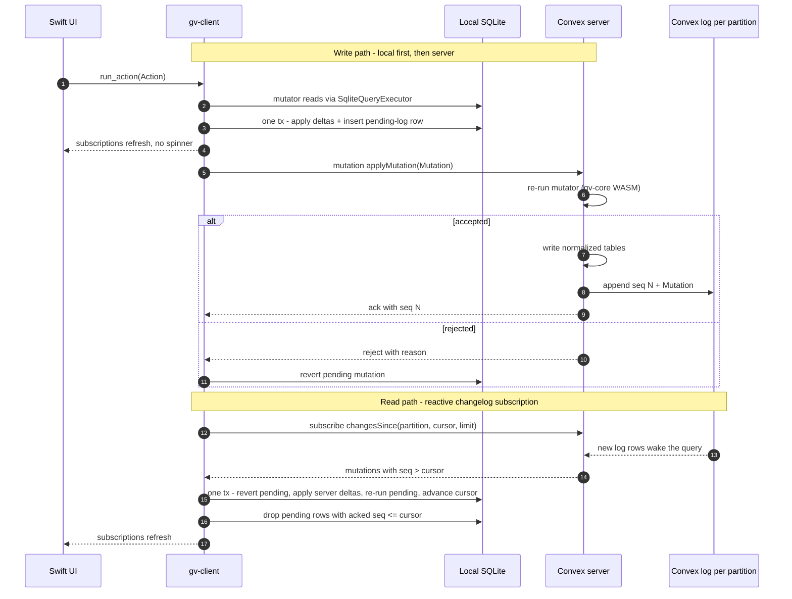
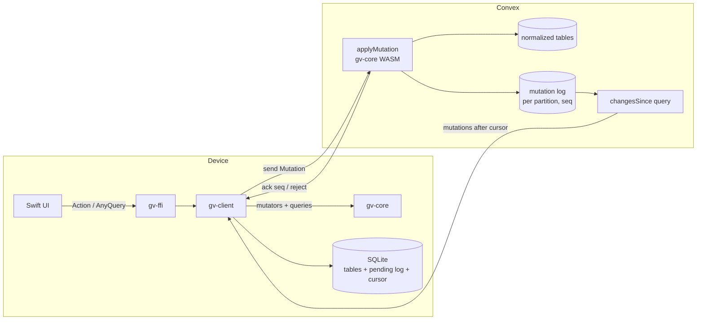

# Convex as a GV Backend — Evaluation

Status: research, no design or code. Started 2026-10-01.

The question: how viable is [Convex](https://convex.dev) ([Rust client](https://docs.rs/convex/latest/convex/))
as GV's backend, given the existing Action → Mutator → Mutation → Delta and Query → QueryExecutor
architecture? How much of the existing model has to change, and how far does Convex reach into
the codebase?

## Current positions

- **Offline writes: very high priority.** Not worth any cost, but an app that breaks on poor
  connectivity isn't acceptable.
- **Coaching is the primary non-owner write path.** It's a whole market segment, not speculative.
- **Each user's data is disjoint (current lean).** Copy-on-add, plus a global library that holds
  only templates/basis. Not fully resolved.
- **HTTP API: undecided** whether it has to be a Rust server.

## Summary

- **Domain models don't need to change.** Convex sits behind the existing `QueryExecutor<Q>` /
  `AnyDeltaExecutor` seam. A new boundary crate (`gv-convex`, playing the role of the Postgres
  half of `gv-sql`) maps domain types to Convex documents.
- **GV's write model already matches Convex's.** A GV mutator is "args → transactional reads →
  writes, deterministic, with time and randomness injected", which is exactly a Convex mutation.
  The design in `sync.md` (server reconciliation, client rebase, server sequence numbers) is also
  the design Convex published for local-first
  ([Object Sync Engine](https://stack.convex.dev/object-sync-engine)). Convex hasn't shipped the
  local half.
- **The crux is where mutators run on the server.** Convex server functions are TypeScript in V8;
  GV's mutators are Rust. Coaching means the server has to enforce invariants and grants, so real
  mutators have to run server-side.
- **Current lean: Approach B** (Convex as the sync spine into local SQLite) with `gv-core`
  compiled to WASM and running inside Convex mutations. **A WASM spike is the go/no-go test.** If
  `gv-core` can't run in a Convex mutation, the alternatives are a TypeScript port of the mutators,
  or keeping a Rust server, at which point Convex adds little over Postgres plus GV's own sync.

## Running mutators on the server

1. **Port the mutators to TypeScript.** Two copies of every invariant, the single Rust core is
   lost, and deterministic simulation no longer covers the server. Last resort.
2. **Compile `gv-core` to WASM and run it in a Convex mutation.** The default Convex runtime
   supports `WebAssembly.instantiate`
   ([runtimes](https://docs.convex.dev/functions/runtimes)).
   - A Rust `ConvexQueryExecutor` would implement `QueryExecutor<Q>` by awaiting JS promises that
     wrap `ctx.db` (via `wasm-bindgen-futures`).
   - The mutator returns a `Mutation`; a thin TS shim applies its deltas with
     `ctx.db.insert/patch/delete`.
   - Convex's determinism rules line up with the `Io` trait: `Date.now()` is frozen per function
     and `Math.random` is seeded.
   - Unverified risks: wasm-bindgen glue inside the Convex isolate, bundle size, the 1s
     user-code limit, and serde `arbitrary_precision` across the JS boundary. Partly answered in
     [Research update — 2026-10-02](#research-update--2026-10-02).
3. **Client-computed deltas, validated on the server (rejected).** The server checks each
   `Delta::Update/Delete` `old` against the current row and rejects on mismatch; the client
   rebases (re-runs the `Action`) and resubmits. Reconciliation still happens, but on the client.
   Rejected because:
   - It's coarser than re-running on the server. Two devices editing different fields of the same
     entry conflict instead of merging.
   - Invariants that depend on reads (e.g. `move_entry`'s cycle check over ancestors) need the
     mutator's full read set sent and validated.
   - The server enforces no domain invariants, which coaching rules out.

## Approach A: online-only, cut at Action / AnyQuery

The Convex client replaces local SQLite. `gv-client`'s `QueryStore` maps each `AnyQuery` to a
Convex subscription, and `run_action` becomes `mutation("gv:runAction", {action})`.

- **Swift can stay unchanged.** The official
  [Convex Swift SDK](https://github.com/get-convex/convex-swift) is the Rust client wrapped with
  uniffi, so `gv-client` can embed `convex::ConvexClient` directly.
- **Better invalidation.** Convex re-runs a query only when its read set changes, instead of the
  current re-run-everything in `refresh_subscribed_queries`.
- **Query rewrites.** The 18 queries become Convex query functions. The recursive CTEs
  (`FindDescendants`, `FindAncestors`) become level-by-level index walks.
  `EntriesRootedInTimeInterval` needs a stored, indexed canonical-instant field.
- **No optimistic UI.** The Rust client has no optimistic-update API
  ([BaseConvexClient](https://docs.rs/convex/latest/convex/base_client/struct.BaseConvexClient.html):
  subscribe / mutation / action / resend-on-reconnect). Convex's JS optimistic updates are
  hand-written patches per query, which would duplicate mutator logic.
- **Pending mutations aren't durable.** They're queued in memory and resent on reconnect, but lost
  if the app is killed.
- **No offline, and analysis gets awkward** (see Planned features).

Approach A rules out offline writes for good.

## Approach B: Convex as the sync spine into SQLite

GV's `Mutation` (action + deltas) is the sync payload.

- **Server.** `applyMutation` re-runs the mutator, writes the normalized tables, and appends
  `{seq, mutation}` to a per-partition log.
- **Client.** `changesSince(partition, cursor, limit)` is an ordinary reactive Convex query (an
  index range `seq > cursor` with `.take(n)`) that re-runs whenever the log grows. The client
  applies the incoming `AnyDelta`s through the existing `SqliteDeltaExecutor` and stores the
  cursor in SQLite.

**What Convex replaces:** Electric/durable streams, the `ivm`/DBSP read-path plans, WebSocket
transport, the Postgres server, and auth plumbing.

**Why not Convex's streaming export API:** `document_deltas` / `list_snapshot` require a deploy
key, so they're for server-side ETL, not clients
([streaming export](https://docs.convex.dev/streaming-export-api)).
[PowerSync's experimental Convex connector](https://releases.powersync.com/announcements/announcing-convex-backend-support-experimental)
(June 2026) builds on it, but PowerSync owns its own SQLite schema and polls every second. It
would intrude on `gv-sql` more than a hand-built log.

### Online-first vs. offline under B

Applying writes locally first (needed for the no-spinner UX) already requires rebasing, since
another device's changes can land while a write is in flight. Offline adds:

- A durable pending log: a SQLite table, at the `TODO` in `client.rs` `run_action`.
- UX for rejections that arrive late, after a long offline stretch.
- Catch-up after a long absence: log compaction plus a snapshot at the log head (see the Electric
  notes in `sync.md`).

None of these change the architecture. One option is to ship B online-first with the
offline-ready structure, then harden offline.

### GV-side prerequisites (needed for any server-reconciliation backend)

- **Deterministic IDs and timestamps across client and server runs.** If the server re-runs
  `create_entry_from_activity`, `io.uuid()` must produce the IDs the client used, or the client's
  later actions reference IDs that don't exist on the server. Option: seed the server's `Io` from
  `mutation.id` (UUIDv5 of mutation id plus a counter).
- **Fix an `Io` leak.** `instantiation.rs` calls `chrono::Utc::now()` directly instead of going
  through `Io`.
- **Dedupe on the server by mutation id**, so resends are idempotent.

## What changes

| Layer | A (online) | B (sync spine) |
|---|---|---|
| Domain models / actions / queries | unchanged | unchanged |
| Mutators | run server-side | run on both sides |
| `gv-sql` SQLite side | retired | kept |
| `gv-sql` Postgres side, `gv-server`, `ivm` | retired | retired |
| New | `gv-convex` crate, TS query functions, Convex schema | `gv-convex` crate, `applyMutation` / `changesSince`, Convex schema |
| Swift | unchanged | unchanged |

**Encoding notes for `gv-convex`:**

- Keep `Uuid` as an indexed field. Convex assigns its own `_id`, so GV gives up typed `v.id()`
  references.
- Timestamps become `i64` milliseconds.
- `Value` data maps onto Convex objects; GV already uses external tagging. Convex has `Int64`
  and `Float64`, and the 2-decimal cap fits `f64`.
- Fractional-index strings sort fine.
- Check `convex::Value`'s `TryFrom<serde_json::Value>` against `arbitrary_precision`.
- Document limits: 1 MiB per document, 8192 array elements. A large mutation (e.g. a
  `DeleteEntryRecursive` over a big tree) may need its deltas stored as a JSON string.

**How far Convex reaches:**

- **Under A**, it's the whole runtime: server language, schema, latency, and whether the app works
  at all.
- **Under B**, it's a second schema definition (`schema.ts` alongside the SQLite migrations), a
  few TS shims, auth, and deployment. The sync design stays GV's own.
- **Lock-in is softer than SaaS.** The backend is open source and self-hostable
  ([convex-backend](https://github.com/get-convex/convex-backend)).

## Planned features

- **Analysis** pulls toward B. The analysis design is an in-memory interpreter over loaded domain
  data, which is unlimited over local SQLite. A single Convex query or mutation caps at 32k
  documents scanned and 16 MiB read ([limits](https://docs.convex.dev/production/state/limits)),
  and a few years of entries and values will exceed that. Under A, analysis needs paginated,
  non-reactive loads into memory (a worse local replica) or aggregates precomputed on the server.
- **Coaching** requires server-side mutators (option 2).
  - Write conflicts now happen between different users (coach vs. athlete), not just one user's
    devices. Rejection and rebase become a real UX path for the coach.
  - Copy-on-add crosses partitions. "Coach adds a workout from their library to the athlete's log"
    reads the coach's partition and writes the athlete's, which works inside one Convex mutation.
  - Grants on a whole partition map cleanly to `changesSince` streams. Narrower grants (e.g.
    root-write + read-your-writes in `permissions.md`) need filtered streams. Keeping grants
    coarse at first keeps sync simple.
- **LLM import / Strava.** Convex actions (which allow `fetch`, scheduling, and cron) can host
  ingest jobs that write through `applyMutation`; UUIDv5 idempotency carries over.
- **Media.** Convex file storage fits the "sync metadata, cache blobs" idea in `sync.md`.
- **Deterministic simulation testing.** Under B, the server is `gv-core` plus delta apply,
  simulable with the in-memory executor, with Convex as a mocked transport. Under A, the server is
  mostly outside the simulation.
- **HTTP API.** Convex HTTP actions can call the same mutation path, so a Rust HTTP server isn't
  required, but this is undecided.

## What disjoint data buys

- **The global sequence number in `sync.md` becomes a per-partition sequence number.** Conflicts on
  the counter document are limited to the partition's writers: one user's devices, plus coaches.
- **Each partition is one sync stream.** The global library is one more partition, read-only to
  users.
- **Copy-on-add means user rows never reference library rows**, so there are no consistency rules
  across partitions.

## Research update — 2026-10-02

From a research pass over the Convex docs and the open-source `convex-backend` source (HEAD
`0f399ed`). Source-derived claims weren't independently re-checked. *Inferred* marks
conclusions drawn from reading code rather than stated in docs.

### WASM in queries and mutations

- **Supported.** `import m from "./x.wasm"` yields a `WebAssembly.Module` (needs a
  `convex/wasm.d.ts`). The bundler inlines the bytes and compiles the module synchronously when
  the JS module is evaluated ([runtimes](https://docs.convex.dev/functions/runtimes);
  `npm-packages/convex/src/bundler/wasm.ts`). wasm-bindgen `--target web` `initSync({module})`
  fits this shape.
- **Limits.** The only documented code limit is 32 MiB of code per deployment. Isolate user heap
  is 64 MiB, with a separate ArrayBuffer cap (`crates/common/src/knobs.rs`). Unknown: whether
  WASM linear memory counts against those caps.
- **wasm-bindgen glue globals are present:** `TextEncoder` (incl. `encodeInto`), `TextDecoder`,
  `crypto.getRandomValues`, `atob`/`btoa`, `performance.now`. `queueMicrotask` is missing, but
  `wasm-bindgen-futures` falls back to `Promise.resolve().then`.
- **Awaiting `ctx.db` from Rust** via `JsFuture` looks like ordinary promise chaining
  (*inferred*). JSPI is on by default in Convex's V8 version, as a fallback (*inferred*).
- **Determinism maps onto `Io`.** `Math.random` / `getRandomValues` are seeded, `Date` is frozen
  per function, and there's no `eval` and no `fetch` in queries/mutations. No `Worker`, so no
  WASM threads; `gv-core` is single-threaded anyway.
- **Per-call cost is the main concern.** Each request gets a fresh V8 context, and module
  evaluation, including the WASM compile, counts against the 1s user-code limit (*inferred*
  from `udf/phase.rs`). An undocumented `export const experimental_reuseContext = true` allows
  context reuse, but the source says reuse isn't guaranteed and state leaks between calls. Not
  something to depend on.
- **No public precedent.** No blog post, issue, or Discord thread found of Rust/wasm-bindgen
  modules running in Convex mutations.
- **`convex-in-prod/convex-wasm-compiler` isn't relevant.** It's unofficial ("not an official
  Convex project") and compiles Convex *TypeScript* functions to WASM for a self-hosted runtime.
- **Strategic risk: a future runtime.** `convex-backend` has hooks for an in-progress
  Wasmtime-hosted JS runtime (`WASM_UDF_MAX_HEAP_SIZE`, `wasm-runtime-bundler`, "TODO(runtime):
  wasmtime impl"). Its globals install no `WebAssembly` (*inferred* from the globals file).
  Unannounced; if it ever became the default for queries/mutations, the WASM-mutator plan would
  break. Worth asking Convex before committing.

### Components

- **What they are.** Packages with their own `schema.ts`, tables, and functions, declared in
  `convex.config.ts`. They can be local or published to npm, and you can author your own. Calls
  are sub-transactions that commit atomically with the caller. Inside a component there's no
  `ctx.auth` and none of the app's env vars, and ids cross the boundary as strings
  ([authoring](https://docs.convex.dev/components/authoring),
  [understanding](https://docs.convex.dev/components/understanding)).
- **They don't help the WASM plan.** A WASM mutator engine could be packaged as a component (same
  bundler), but GV gains little: auth has to be passed in, ids become strings, and WASM is
  probably still re-instantiated per call.
- **Existing components of possible later use:** `migrations`, `table-history` (audit log of a
  table's edits), `aggregate`. None for offline or local-first sync of relational data.

### Status checks

- **No first-party offline sync.** A Convex staff comment (2026-09-24) says the object-sync-engine
  prototype won't be released and there are "no immediate plans to offer a first-party offline
  sync solution" ([curvilinear#6](https://github.com/get-convex/curvilinear/issues/6)). The Rust
  client (`convex` 0.10.4) and the Swift client have no public optimistic-update API and no
  durable offline queue. Approach B has to be built by GV, as assumed above.
- **Backups.** Manual backups on all plans, kept 7 days; daily/weekly backups need Pro. Restore
  is destructive and replaces the whole deployment; no point-in-time recovery. Export is a ZIP of
  JSONL per table ([backup-restore](https://docs.convex.dev/database/backup-restore)). GV's own
  snapshots ([durability-and-dogfooding.md](./durability-and-dogfooding.md)) would remain the
  trust layer.
- **Schema evolution.** A deploy fails if any existing document doesn't match the schema. The
  recommended path is to add the field as optional, migrate, then make it required, using the
  `migrations` component ([schemas](https://docs.convex.dev/database/schemas)).

## Open questions

- Can `gv-core` run as WASM inside a Convex mutation within the runtime and time limits? (The spike.)
- Will Convex's in-progress Wasmtime-hosted runtime support `WebAssembly`, and could it replace
  V8 for queries/mutations? (Ask Convex.)
- HTTP API: Convex HTTP actions, or a Rust server?
- Grant model for coaching: partition-level first, or finer from the start?
- Log compaction and snapshot strategy for long-offline clients.

## Next step

Spike: build `gv-core` as WASM with a `ConvexQueryExecutor`, then run `move_entry` (reads
ancestors, writes one entry) inside a local Convex dev deployment. Confirm that async `ctx.db`
calls work from Rust, then measure:

1. Per-call cost of module evaluation plus WASM compile/instantiate for a release build, against
   the 1s limit. Measure with and without `experimental_reuseContext`, but don't depend on it.
2. Whether WASM linear memory counts against the 64 MiB caps, and peak memory on a large
   `DeleteEntryRecursive`.
3. Cost of JSON crossing the JS/WASM boundary (`TextEncoder.encodeInto` is a host op), and how
   `arbitrary_precision` behaves across that boundary.

## Sources

- [convex Rust crate](https://docs.rs/convex/latest/convex/)
- [BaseConvexClient](https://docs.rs/convex/latest/convex/base_client/struct.BaseConvexClient.html)
- [Convex runtimes](https://docs.convex.dev/functions/runtimes)
- [Convex limits](https://docs.convex.dev/production/state/limits)
- [Optimistic updates](https://docs.convex.dev/client/react/optimistic-updates)
- [Object Sync Engine for Local-first Apps](https://stack.convex.dev/object-sync-engine)
- [Streaming export API](https://docs.convex.dev/streaming-export-api)
- [PowerSync Convex support (experimental)](https://releases.powersync.com/announcements/announcing-convex-backend-support-experimental)
- [convex-swift](https://github.com/get-convex/convex-swift)
- [convex-backend](https://github.com/get-convex/convex-backend)
