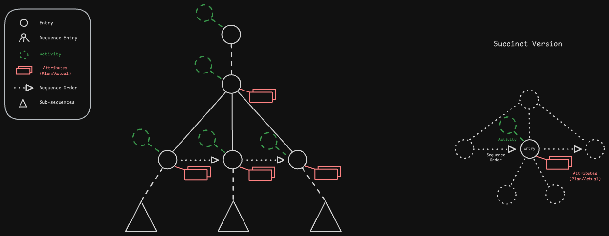

The Gainzville model.

### Activities and Entries

An **activity** defines an exercise or event with a name, description, and other information. 
Activities are created by users or provided by Gainzville. Examples: Pull Up, Run, Rock Climbing,
Bouldering, Bench Press, Single Leg Romanian Deadlift, Woke, Went to Bed, Work, Studying,
Freestyle Swim, Danny's Core Routine, Nelson Strength, Achilles Rehab, etc.

An activity is just a description, not a record of something that happened. An **entry** is a record
of something that happened or is planned to occur (or a template, see below). An entry may be
associated with an activity (sometimes referred to as being an instance of an activity) to convey
information about what the entry represents. An entry is associated with 0-1 activities, and an
activity is associatd with 0-n entries.

Activities support queries like "find all the times I went running" by providing an identity to the
concept of "running" that is unambiguous (we don't rely on the name to identify the activity) and
unique (we can differentiate between any activities regardless of naming). Associating an entry with
an activity tells Gainzville what that entry means.

Activities allow users to configure which attributes are attached to an entry of that activity by
default and the default values for those attributes via templates (see Template and Log Entries). If
an activity is a sequence (see Scalar and Sequence Entries), the template specifies the activities 
that make up the sequence.

Activities configure default attributes for an entry of that activity, but a user is free to add and
remove attributes for an particular entry.

An entry must have the same owner as the associated activity. (Copy-on-add semantics, see
[sync](./sync.md)).

#### Anonymous Entries
An entry which is not associated with an activity is an **anonymous entry**.
An anonymous scalar entry must have a name defined on the entry.
An anonymous sequence entry may not have a name defined.

#### Template and Log Entries
An **activity template** (or **template entry**) is a configuration for creating an entry of that
activity. The template is an entry and attached attribute values or child entries describe what a
default instance of that activity looks like and, for sequences, the structure of the sequence. The
`is_template` column of the entry denotes whether that entry is a template.

Any entry which is not a template is a **log entry**. A log entry represented something which has
happened or is planned.

#### Scalar and Sequence Entries
Entries are either **scalar** and contain no children, or **sequences** containing 0-n child entries.

#### Hierarchy
Entries form a forest (a set of trees). An entry includes a nullable pointer to it's parent, which
must be a sequence.
A **root entry** is an entry with no parent.
A **non-root entry** or **child entry** is an entry with a defined parent.
Template and log entries are **disjoint**: a log entry cannot be a child of a template entry and a
template entry cannot be a child of a log entry.

#### Ordering
All children of a single parent are totally-ordered by a fractional index defined on the child.
Root entries do not contain

The `parent_id` and `frac_index` on an entry are atomic - they must always be updated together. This
corresponds with the fact that fractional index is only meaningful in the context of a particular
parent sequence.

#### Planning

An log entry is either completed or incomplete (aka **planned**).

A template entry is neither complete nor incomplete.

Open question: can sequences be completed? Simplest model: only implicitly - a sequence is complete
if all descendant entries are complete. In the UI, we may still present a "complete" button on a
sequence, but the effect is to complete all descendant entries.

#### Sets and Reps

The goal of the following is to support the standard conception of "sets" and "reps" in athletics
within the Gainzville model.

**Sets** are sequences of entries where each entry is an instance of the same activity. Each set
(e.g. entry) may have different attribute/value pairs associated with it. Entries belonging to the
same set have a parent pointer to that set and the column value `as_set = true`. The UI presented
is significantly different than a standard sequence of entries: the user sees the common activity
(or entry name, if the entry is anonymous) and carousel-like picker to choose between sets. Roughly:
```
Push-Up
  Set    [1], 2, 3, +
```
A user can "break out" the sets to return to the standard sequence of entries view and remove the
constraint that entries are homogenous. The above would result in something like:
```
________________
|             *|
| Push-Up      |
| Push-Up      |
| Push-Up      |
----------------
```

**Reps** are repetition of the same entry with the same attribute values. They are represented
internally by a special numeric attribute called, unsuprisingly, Reps. They are interpreted as
duplcation of the described entry, e.g.
```
Bench Press
    Load: 100 lbs
    Reps: 15
```
is interpreted as 15 bench entries, each with a load of 100 lbs.


#### Temporal Data
Temporal data describes the start, end, and duration of an entry. A temporal value is defined by 0-2
of these options:
- None.
- Start.
- End.
- Duration.
- Start and end.
- Start and duration.
- Duration and end.

Template entries may have a duration but not a start time or end time; this corresponds to the fact
that template entries have not "occurred".

### Attributes and Values
An **attribute** describes a set of possible **values**. Attributes have a data type (see Attribute
Types) and sometimes optionally define additional constraints on the data type (min value, if the
set is ordered, etc.). Users may create attributes and some attributes are provided by Gainzville.

A value is associated with both an attribute and an entry: it is an instance of the attribute and
describes the entry.

Attributes provide consistent identity to data describing activities: without an attribute, there is
no way to know if two numeric values are comparable. By associating values with attributes, those
attributes become interpretable and comparable. Attributes and values support queries like:
- What is the longest run I went on last month? Find all entries of the activity "run" and then find
the maximum "duration" value. (This is example slightly complicated, because duration is a built-in
attribute, but the idea is the same.)
- What was the maximum load I bench pressed this year? Find all entries of the activity "bench
press" in the last year and then find the entry with the largest "load" value, where load is an
attribute.

An entry may be described by a 0-1 values for a given attribute. Values are uniquely identified by
the tuple (entry_id, attribute_id).

The owner of a value must be the same as the owner of the associated attribute and the described
entry. To support this and avoid inconsistencies, values do not have an `owner_id` field.

#### Table Model
Considering using JSON (or JSONB) storage to avoid one table for each attribute type and each value
type. In that case, Attribute and Value tables would ideally store the data type and the index in
columns to improve query performance. Simplest approach would be to have nullable index columns for
each index type, e.g.
```sql
CREATE TABLE value (
    ...,
    data JSONB NOT NULL,
    data_type TEXT NOT NULL,
    index_float FLOAT,
    index_string TEXT,
    ...
);
```

#### Special Attribute
- Timestamps/datetimes are not represented as attributes/values, rather through the temporal defined
on `Entries`.
- Reps and Sets have specialized semantic meaning so they are represented through the buit-in `Reps`
attribute.
- Load is just a mass value, but we want to be able to interpret it in the domain.
- Bodyweight is just a mass value, but we want to be able to interpret it in the domain, e.g. to
compute the absolute load of a pull-up.

#### Attribute types
##### Numeric
A scalar integer or float.
- Can be constrained by the attribute defintion, e.g. to have a min value.
- **Index type:** `float`.

##### Text
A Unicode string. Probably need some more constraints beyond that.
- **Index type:** `string`.

##### Select
A set of options from which a single value is selected. 
- Can specify that the set is ordered.
- Options are strings.
- **Index type**: `string`.

##### Multiselect
A set of options from which 0-n values are selected.
- Options are strings.
- **Index type:** `???`.

##### Measures
A scalar measurement in an SI unit. The UI supports representation in a combination of denormalized
units, e.g. time may be represented as hours + minutes + seconds. The denormalized represention is
stored for a consistent UX while the normalized representation (in the SI base unit) is stored for
indexing and comparison. The 
- Units I want to support soon: time (s), length (m), mass (kg).
- Will eventualy want to support composite units: speed (m/s), joules to support calories (N*m), etc.
- Will eventually want kelvin K for temperature.
- **Index type:** `float`.

### Categories
A **category** groups activities together to provide a broader description of activities. For
example, running, cycling, hiking, and backcountry skiing are all cardiovascular exercises.
Categories represent this type of relationship and support recursive definition, so that in the
previous example cycling could be a category containing road cycling, mountain biking, and gravel 
biking.

Categories allow for queries like "find all the cardio training I did this week" or "find the amount
of time I spent climbing this week" when there are many activities which qualify as  "cardio" or 
"climbing", and we want an easy and consistent way to refer to all of them.

A category is just an activity and can be recorded or planned, this supports building higher level
training plans where you say something like, "do a strength workout for 60-90 minutes". Many 
exercises (bench press, weighted pull-ups, squats, deadlifts, overhead press, etc.) qualify as 
strength exercises, so this plan is "satisfied" by any of those activities.

Categories form a directed-acyclic graph. One implementation approach: categories are just 
activities, with the addition of an "is in the category of" pointer.

**Open question**: is a category literally just an activity?
- This is a clean model unless it breaks: no new concepts, just relations (categorizations) between
activities.
- Could present a slightly different UX for clarity and organization, e.g. when a user browses their
library of activities, they might want categories to be hidden from view.


### Collaboration: Logs and Libraries
A library is a collection of activities and attributes owned and maintained by a user or other actor
(such as Gainzville).

Every user has a library of activities which they can add to by creating their own activities or
searching the standard library, public libraries of other users, or private libraries shared with
them directly.

Libraries support users saving time by not creating common activities and attributes from scratch,
avoiding duplication of common activities/attributes, discovering new activities, and sharing with
friends, training partners, or coaches. Cannonical use case: "try this core workout" or "here's this
weeks strength routine".

See [sync](sync.md) and [permissions](./permissions.md) for further info.

### Other Underspecified Concepts
**Relative planning:** instead of saying "I plan on doing a bench press on 3/2 at 2pm" say, "I plan
on doing a bench press 3-5 days after workout X". This could be defined recursively.

**Rest:** especially when planning a workout or training in "live mode", it's useful to specify the
duration of rest between exercises.
- Rest could be a property of an entry, so there is an attribute-like option for an entry to set
the rest duration, and setting that duration means "rest this long after this exercise".
- Rest could be a special kind of entry. This presents the problem of moving entries: in most use
cases, you'd probably want the rest entry to "follow" the preceding entry. This could be solvable
by good move UX (easily move multiple items).
- Could present a specialized UX for rest, less obtrusive than a regular entry, hide/show depending
on context or settings (i.e. show when planning a workout or in live mode, hide when looking at past
workouts).

**Tags**: a tag could act like a "one-off" category: instead of saying "every run is a cardio
exercise" you could say "this run is a recovery exercise", i.e. a tag is attached to an entry
instead of an activity.

**Isomorphism**: inevitably activities and attributes will be duplicated by different users. It
would be helpful to provide a way of saying "these two things are the same". Could actually be a use
case for cycles in the category graph: "bench press" is a "barbell press" and vica versa. Attributes
are more complicated. Primary use case I see is user A adding something to their library and it 
including activities/attributes they already have a version of. They could "swap" the pointer to
their version, but that's manual and annoying; better to once and for all say they're the same.
